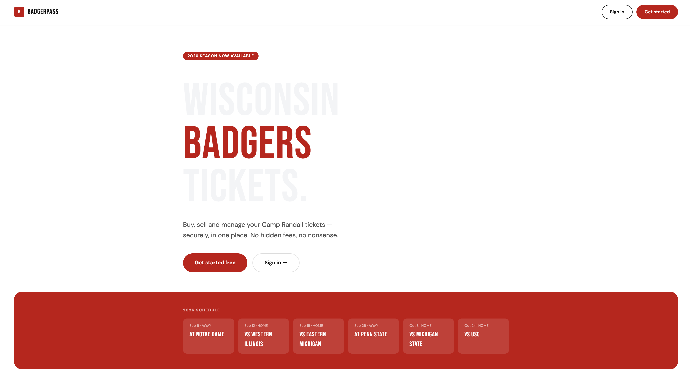
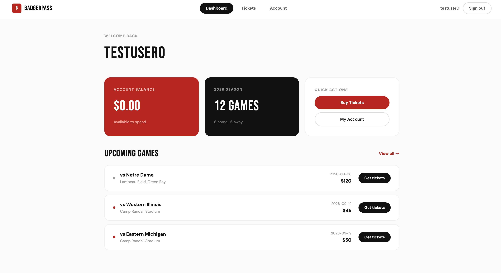
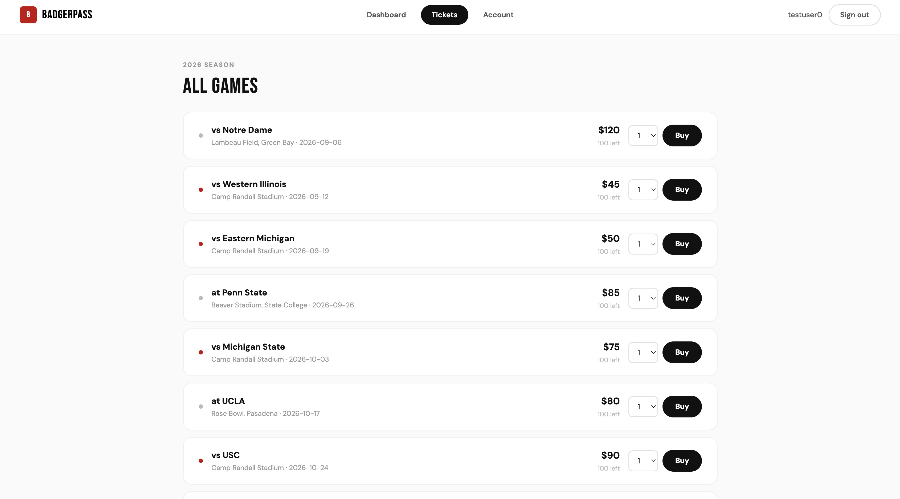
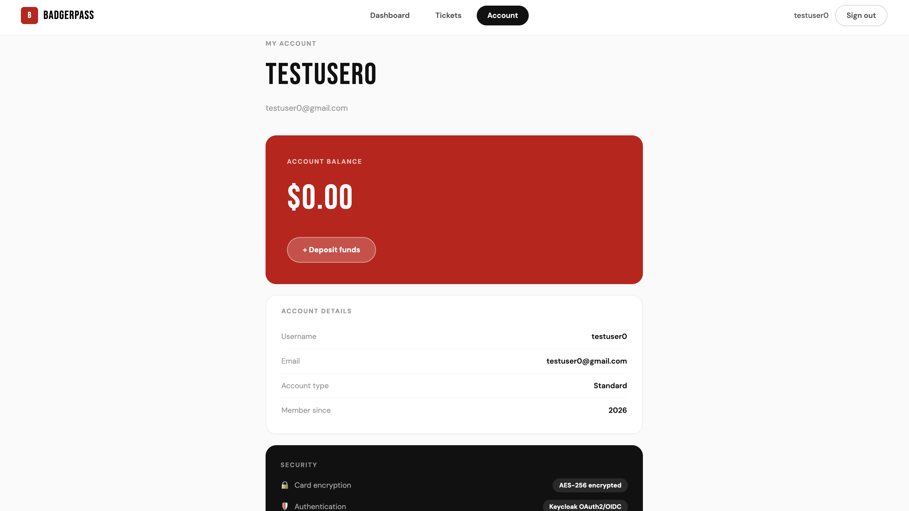
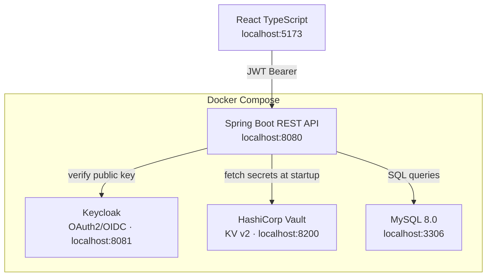
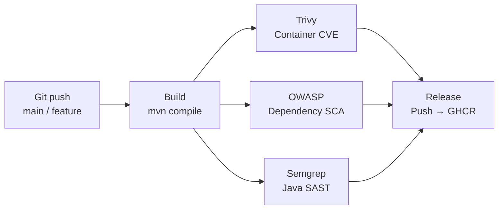
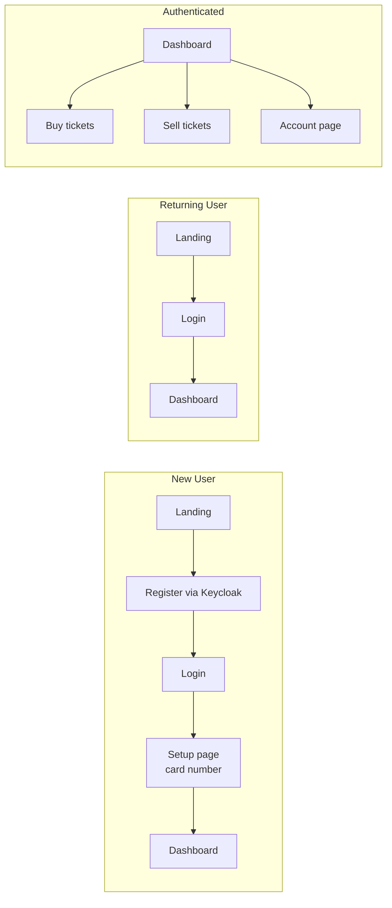

# BadgerPass 🦡

A full-stack ticket commerce platform for Wisconsin Badgers football, built as a security engineering portfolio project. BadgerPass demonstrates end-to-end implementation of IAM, secrets management, DevSecOps CI/CD, and AES-GCM encryption across a containerised Spring Boot + React stack.

---

## Screenshots

| Landing | Dashboard |
|---|---|
|  |  |

| Tickets | Account |
|---|---|
|  |  |

---

## Architecture



---

## CI/CD Pipeline



---

## User Flow



---

## Tech Stack

| Layer | Technology |
|---|---|
| Backend | Java 21, Spring Boot 3.5, Spring Security |
| Authentication | Keycloak 24 (OAuth2/OIDC) |
| Secrets | HashiCorp Vault (KV v2) via Spring Cloud Vault |
| Database | MySQL 8.0 |
| Frontend | React 19, TypeScript, Vite |
| Containerisation | Docker, Docker Compose |
| CI/CD | GitHub Actions |
| Security scanning | Trivy, OWASP Dependency-Check, Semgrep |
| Registry | GitHub Container Registry (GHCR) |

---

## Security Features

**OAuth2/OIDC via Keycloak** — self-hosted identity provider handling registration, login, and session management. JWT validation enforced at the Spring Security filter layer via `KeycloakRoleConverter` which extracts roles from `realm_access.roles`.

**Role-based access control** — `user` and `admin` roles enforced via `@PreAuthorize` annotations. New users automatically assigned the `user` role on registration.

**AES-GCM encryption** — card numbers encrypted at rest with a random 12-byte IV per encryption. Encryption key injected at runtime from Vault — never hardcoded.

**HashiCorp Vault** — centralised secrets management via Spring Cloud Vault. No hardcoded credentials anywhere in the codebase. Secrets injected at startup via `@Value` and `@PostConstruct`.

**DevSecOps CI/CD** — GitHub Actions pipeline with three security gates:
- Trivy — container image CVE scanning, pinned to `v0.35.0` post-March-2026 supply chain incident
- OWASP Dependency-Check — SCA on Maven dependencies, blocks on CVSS ≥ 7
- Semgrep — SAST on Java source code

**Stateless sessions** — `SessionCreationPolicy.STATELESS` enforced. Every request verified independently via JWT signature using Keycloak's public key — no server-side session storage.

**Token refresh** — frontend uses `keycloak.updateToken(30)` before every API call to silently refresh expired access tokens, keeping users logged in for the duration of their SSO session.

---

## Prerequisites

- Java 21+
- Maven 3.9+
- Docker + Docker Compose
- Node.js 20+

---

## Local Setup

### 1. Clone the repo

```bash
git clone https://github.com/YccYeung/badgerpass.git
cd badgerpass
```

### 2. Create `.env` file

```bash
cp .env.example .env
```

Fill in your values:

```env
DB_USER=your_username
DB_PASSWORD=your_password
DB_NAME=your_db_name
DB_ROOT_PASSWORD=your_root_password
VAULT_DEV_TOKEN=your_token
KEYCLOAK_CLIENT_SECRET=your_keycloak_client_secret
```

### 3. Start infrastructure

```bash
docker compose up -d
```

Starts MySQL, Keycloak, and Vault.

### 4. Configure Keycloak

1. Go to `http://localhost:8081` → sign in as `admin`
2. Create realm: `badgerpass`
3. Create client: `badgerpass-api` — confidential, client auth ON, direct access grants ON
4. Create client: `badgerpass-web` — public, client auth OFF, redirect URI `http://localhost:5173/*`, web origin `http://localhost:5173`
5. Create roles: `user`, `admin`
6. Enable user registration: **Realm settings → Login → User registration ON**
7. Disable email verification: **Realm settings → Login → Verify email OFF**
8. Set default role: **Realm settings → User registration → Default roles → add `user`**
9. Copy `badgerpass-api` client secret and add to `.env` as `KEYCLOAK_CLIENT_SECRET`

### 5. Configure Vault

```bash
docker compose exec vault sh -c 'VAULT_ADDR=http://127.0.0.1:8200 VAULT_TOKEN=testtoken vault kv put secret/badgerpass \
  aes_key="your_base64_aes_key" \
  db_username="your_db_user" \
  db_password="your_db_password" \
  keycloak_client_secret="your_keycloak_secret"'
```

### 6. Seed the database

```bash
docker compose exec mysql mysql -u $DB_USER -p$DB_PASSWORD $DB_NAME < schedule.sql
```

### 7. Run the backend

```bash
export VAULT_DEV_TOKEN=testtoken
export KEYCLOAK_CLIENT_SECRET=your_secret
make
```

### 8. Run the frontend

```bash
cd frontend
npm install
npm run dev
```

Visit `http://localhost:5173`

---

## API Endpoints

### Account

| Method | Endpoint | Role | Description |
|---|---|---|---|
| GET | `/api/account/me` | user | Check if account setup is complete |
| POST | `/api/account/setup` | user | Save card number for new user |
| GET | `/api/account/balance` | user | Get account balance |

### Tickets

| Method | Endpoint | Role | Description |
|---|---|---|---|
| GET | `/api/tickets` | user | Get full 2026 game schedule |
| GET | `/api/tickets/my` | user | Get user's ticket holdings |
| POST | `/api/tickets/buy` | user | Purchase tickets |
| POST | `/api/tickets/sell` | user | Sell tickets |
| GET | `/api/admin/tickets` | admin | Admin ticket view |

---

## Project Structure

```
badgerpass/
├── src/main/java/com/example/ticketsystem/
│   ├── config/
│   │   ├── SecurityConfig.java          # Spring Security, CORS, OAuth2
│   │   └── KeycloakRoleConverter.java   # JWT role extraction
│   ├── controller/
│   │   ├── AccountController.java       # /api/account endpoints
│   │   └── TicketController.java        # /api/tickets endpoints
│   ├── service/
│   │   ├── AccountService.java          # Account business logic
│   │   ├── TicketService.java           # Ticket business logic
│   │   └── AESEncryption.java           # AES-GCM encryption
│   ├── repository/
│   │   └── TicketSystemDB.java          # Data access layer
│   └── model/
│       ├── SetupRequest.java
│       └── TicketRequest.java
├── frontend/
│   └── src/
│       ├── pages/                        # LandingPage, DashboardPage, TicketsPage, AccountPage, SetupPage
│       ├── components/                   # Navbar, ProtectedRoute
│       └── services/
│           └── api.ts                    # authFetch with token refresh
├── .github/workflows/
│   └── pipeline.yml                     # CI/CD pipeline
├── docker-compose.yml
├── Dockerfile
├── Makefile
└── schedule.sql                         # 2026 Wisconsin Badgers schedule seed data
```

---

## Roadmap (v2)

- [ ] Payment Service microservice (mock bank API)
- [ ] Notification Service (email via Kafka events)
- [ ] Kafka event streaming (`ticket.purchased`, `payment.processed`, `ticket.sold`)
- [ ] Reseller marketplace
- [ ] GKE Autopilot deployment
- [ ] Admin portal (user management, sales analytics)
- [ ] Basketball season support